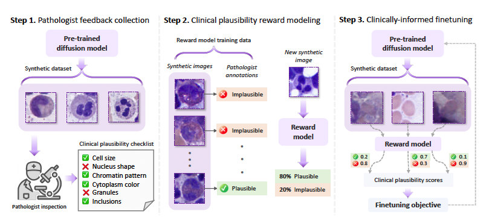
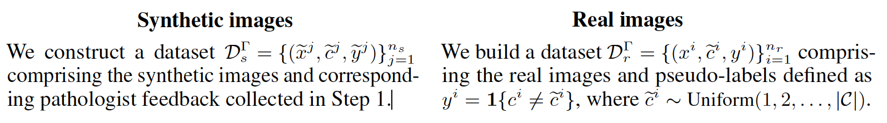

## <p align="center">Aligning Synthetic Medical Images with Clinical Knowledge <br> using Human Feedback </p>
<div align="center">
  <a href="https://scholar.google.com/citations?hl=en&user=KGvc3jwAAAAJ&view_op=list_works&sortby=pubdate" target="_blank">Harry &nbsp;Sun</a> &emsp; 
  <a href="https://hemepath.ai/" target="_blank">Gregory M. &nbsp;Goldgof</a> &emsp; 
  <a href="https://profiles.ucsf.edu/atul.butte" target="_blank">Atul J.&nbsp;Butte</a> &emsp; 
  <a href="https://scholar.google.com.eg/citations?user=_pv1sEcAAAAJ&hl=en" target="_blank">Ahmed M. &nbsp;Alaa</a>
  <br> <br>
  <a href="https://arxiv.org/abs/2306.12438" target="_blank">Paper</a> &emsp;
</div>


https://github.com/AlaaLab/pathologist-in-the-loop/assets/21158134/cce037bf-4dcc-4276-8700-30c8b098ea35 


## Introduction

This is the codespace for "Aligning Synthetic Medical Images with Clinical Knowledge using Human Feedback". 
This paper introduces a pathologist-in-the-loop framework for generating clinically-plausible synthetic medical images. 
Starting with a diffusion model pretrained using real images, our framework comprises three steps: (1) evaluating the generated images by expert pathologists to assess whether they satisfy clinical desiderata (2) training a reward model that predicts the pathologist feedback on new samples, and (3) incorporating expert knowledge into the diffusion model by using the reward model to inform a finetuning objective. 

We are still actively developing this repo. 

<p align="center">
    
</p>

## Install 
* Dependencies: 
    * CUDA 11.3 
    
* Setup the environment 
    Install from conda file  
    ``` 
        # create a new env
        conda create -n your_env python=3.7.15
        conda activate your_env
        git clone XXX.git
        cd HF/
        pip install -e .
        pip install -r requirements.txt
    ```

## Preparing Data 

To adapt the code for your own dataset, simply place all of your images into a directory with ".jpg", ".jpeg", or ".png" extensions. If you wish to train a class-conditional model, name the files using the following format: "mylabel1_XXX.jpg", "mylabel2_YYY.jpg", etc., and the data loader will recognize "mylabel1" and "mylabel2" as labels. Subdirectories will automatically be enumerated as well, so the images can be organized into a recursive structure (although the directory names will be ignored, and the underscore prefixes are used as names). 

The images will automatically be scaled and center-cropped by the data-loading pipeline. Simply pass --data_dir path/to/images to the training script, and it will take care of the rest.


## Training - Baseline Model
To train your model, you should first decide some hyperparameters. We will split up our hyperparameters into three groups: model architecture, diffusion process, and training flags. Here are some reasonable defaults for a baseline:

* Defaults
    ```
    MODEL_FLAGS="--image_size 64 --num_channels 128 --num_res_blocks 3"
    DIFFUSION_FLAGS="--diffusion_steps 4000 --noise_schedule linear"
    TRAIN_FLAGS="--lr 1e-4 --batch_size 128"
    ```

Here are some changes we experiment with, and how to set them in the flags:

*  Learned sigmas: add --learn_sigma True to MODEL_FLAGS
*  Cosine schedule: change --noise_schedule linear to --noise_schedule   cosine
*  Importance-sampled VLB: add --use_kl True to DIFFUSION_FLAGS and add --schedule_sampler loss-second-moment to TRAIN_FLAGS.
*  Class-conditional: add --class_cond True to MODEL_FLAGS.

Once you have setup your hyper-parameters, you can run an experiment like so:

*
    ```
    python scripts/image_train.py --data_dir path/to/images $MODEL_FLAGS $DIFFUSION_FLAGS $TRAIN_FLAGS
    ```

Here are some changes we experiment with, and how to set them in the flags:

    * Learned sigmas: add --learn_sigma True to MODEL_FLAGS
    * Cosine schedule: change --noise_schedule linear to --noise_schedule cosine
    * Importance-sampled VLB: add --use_kl True to DIFFUSION_FLAGS and add --schedule_sampler loss-second-moment to TRAIN_FLAGS.
    * Class-conditional: add --class_cond True to MODEL_FLAGS.

Once you have setup your hyper-parameters, you can run an experiment like so:

*
    ```
    python scripts/image_train.py --data_dir path/to/images $MODEL_FLAGS $DIFFUSION_FLAGS $TRAIN_FLAGS
    ```

## Training - Reward model

Our framework conceptualize the clinician feedback as a “labelling function” Γ : X × C → {0, 1} that maps the observed synthetic image ex and declared cell type (class) ec to a binary plausibility score. 
Our framework model the “pathologist” by learning their labelling function Γ on the basis of their feedback annotations.
To train a model Γ that estimates the pathologist labelling function, we construct a training dataset that comprises a mixture of real and synthetic images as follows:


<p align="center">
    
</p>


To train the rewarding model on the real images, the real images are prepared following the ImageNet format. For instance, the image_0000.jpg from class A will be saved as "A/image_0000.jpg"; the image_0001.jpg from class Bis prepared as "B/image_0001.jpg".
The synthetic images with human feedback are prepared in the similar format of ImageNet format except the images are subcategorized as "align" and "notalign" under the general category. 


After the reward feedback preparation, simply run 

* 
    ```
    > cd Classifier/
    > python train_scoring_function.py --train_dir XXX  --train_anno_dir XXX --val_dir XXX  --val_anno_dir XXX --save_checkpoints_dir XXX

    ```

After training the model, we could use the scoring function to infer the clinical evaluation. Then save it as a csv file. The csv file has two columns: ID, rewards.
The ID is the name of the image file where the naming is the same as the naming methods in the <Preparing Data>.
The naming is the same as the baseline training model.

## Clinically-informed finetuning

*
    ```
    python scripts/image_finetuned.py --data_pre_dir $DATA_Pre_Dir --data_mod_dir $DATA_Mod_Dir $MODEL_FLAGS $DIFFUSION_FLAGS $TRAIN_FLAGS

    ```


## Released checkpoint and samples

* For this paper, the medical data could not be shared due to the privacy issue.
* The reward model will be shared soon.


## Further reading

For our baseline generative model, we used conditional diffusion model\cite{nichol2021improved}. 
Our fine-tuning pipeline is based on publicly released repository (https://github.com/openai/improved-diffusion.git).
For more details on different parameters for diffusion models, as well as the sampling approches, please refer to this repo.

## Citation

```
@article{sun2023aligning,
  title={Aligning Synthetic Medical Images with Clinical Knowledge using Human Feedback},
  author={Sun, Shenghuan and Goldgof, Gregory M and Butte, Atul and Alaa, Ahmed M},
  journal={arXiv preprint arXiv:2306.12438},
  year={2023}
}
```
